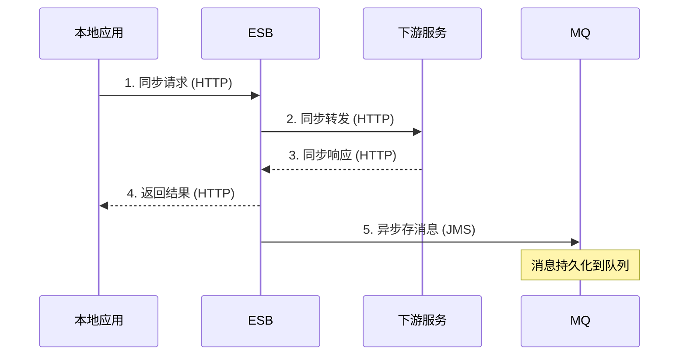
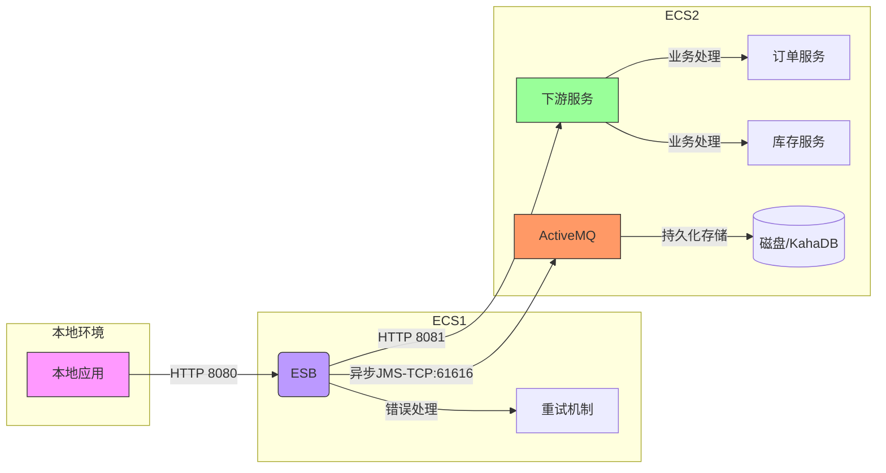

### 一、模拟题目：
在阿里云服务器上搭建如下技术原型：使用两台云服务器和本机来模仿从本地发起请求给ESB（ecs1），然后ESB同步转发请求到下游（ecs2）并接受返回消息，最后异步将这条消息存入mq（ecs2）。

### 二、基础架构设计：
 

1. #### 时序图如下



2. #### 应用架构图如下



### 三、开发源码：
   github：
   https://github.com/sjaylee/esb-demo/

注意：IDEA分别打开子项目：
1. ####  打开子项目：esb-service  （模拟ESB）
2. ####  打开子项目：downstream-service  （模拟下游应用）

### 四、部署安装（手工，后续改为CICD）：
1. 环境：	开网络端口、服务器换源、安装 java17、安装activeMQ、安装lszrz（ == 最耗时间 == ）
2. 应用配置：环境变量改为生产环境

### 五、验证步骤：

1. ####  本地电脑发送请求
* windows电脑发送请求 （win 11 CMD 执行下面命令）：
  ```bath
  curl -X POST "http://47.117.120.129:8080/esb" ^
      -H  "Content-Type: application/json" ^
      -d  "{"orderId":"ORD-20250524-WIN","product":"Book","quantity":3,"price":70.99}"
  ```
* linux 平台发送请求：
  ```bath
  curl -X POST "http://47.117.120.129:8080/esb" \
      -H "Content-Type: application/json" \
      -d '{"orderId":"ORD-20250524-WIN","product":"Book","quantity":3,"price":60.99}'
   ```

2. ####  查看ESB（ecs1）中请求日志：
* 查看ESB的请求处理日志：
	```python
   tail   -100f  /app/esb/logs/esb.log
	```
*  日志内容验证,如果出现如下内容：
   > 2025-05-24T21:31:05.752+08:00  INFO 7724 --- [esb-service] [ qtp92686444-83] route1                                   : == ESB 收到请求: {orderId:ORD-20250524-WIN,product:Book,quantity:3,price:60.99} ==
   2025-05-24T21:31:05.756+08:00  INFO 7724 --- [esb-service] [ qtp92686444-83] route1                                   : == 发送下游应用成功: [Processed] {orderId:ORD-20250524-WIN,product:Book,quantity:3,price:60.99} ==
3. ####  查看下游应用（ecs2）中请求日志：
* 查看下游应用的请求处理日志：
   ```bath
   tail   -100f  /app/downstream/logs/downstream.log
   ```
* 日志内容验证,如果出现如下内容：
   > 2025-05-24T21:31:05.754+08:00  INFO 27080 --- [downstream-service] [tp1447663489-56] main-processing-route                    : : == 接收到ESB请求: {orderId:ORD-20250524-WIN,product:Book,quantity:3,price:60.99}: ==
   2025-05-24T21:31:05.755+08:00  INFO 27080 --- [downstream-service] [tp1447663489-56] main-processing-route                    : : == 业务处理完成，响应内容: [Processed] {orderId:ORD-20250524-WIN,product:Book,quantity:3,price:60.99}: ==
   2025-05-24T21:31:05.755+08:00  INFO 27080 --- [downstream-service] [tp1447663489-56] main-processing-route                    : : == Response Sent to ESB: ==

4. ####  查看MQ（ecs1）中消息异步操作的日志：
* 查看ESB的请求处理日志：
  ``` bath
   tail   -100f  /app/esb/logs/esb.log
  ```
*  日志内容验证,如果出现如下内容：
   > 2025-05-24T21:31:05.756+08:00  INFO 27080 --- [downstream-service] [ad #8 - Threads] async-mq-writer-route                    : == 开始异步写入MQ==
   2025-05-24T21:31:05.769+08:00  INFO 27080 --- [downstream-service] [ad #8 - Threads] async-mq-writer-route                    : == 消息已存入MQ: {orderId:ORD-20250524-WIN,product:Book,quantity:3,price:60.99}==
5. ####  查看MQ服务（ecs2）上的日志：
* ####  ECS2（MQ安装机器上） 输入
  
  ```bath
     /opt/apache-activemq-6.1.6/bin/activemq dstat
  ```
  * #### 结果如下 可以看到消息已经存在队列ESB_MESSAGES 中
         
   >  INFO: Loading '/opt/apache-activemq-6.1.6/bin/setenv'
     INFO: Using java '/usr/java/jdk-17/bin/java'
     Java Runtime: Oracle Corporation 17.0.15 /usr/lib/jvm/jdk-17.0.15-oracle-x64
     Heap sizes: current=67584k  free=65833k  max=1048576k
     JVM args: -Xms64M -Xmx1G -Djava.util.logging.config.file=logging.properties -Djava.security.auth.login.config=/opt/apache-activemq-6.1.6/conf/login.config --add-reads=java.xml=java.logging --add-opens=java.base/java.security=ALL-UNNAMED --add-opens=java.base/java.net=ALL-UNNAMED --add-opens=java.base/java.lang=ALL-UNNAMED --add-opens=java.base/java.util=ALL-UNNAMED --add-opens=java.naming/javax.naming.spi=ALL-UNNAMED --add-opens=java.rmi/sun.rmi.transport.tcp=ALL-UNNAMED --add-opens=java.base/java.util.concurrent=ALL-UNNAMED --add-opens=java.base/java.util.concurrent.atomic=ALL-UNNAMED --add-opens=java.base/sun.nio.ch=ALL-UNNAMED --add-exports=java.base/sun.net.www.protocol.http=ALL-UNNAMED --add-exports=java.base/sun.net.www.protocol.https=ALL-UNNAMED --add-exports=java.base/sun.net.www.protocol.jar=ALL-UNNAMED --add-exports=jdk.xml.dom/org.w3c.dom.html=ALL-UNNAMED --add-exports=jdk.naming.rmi/com.sun.jndi.url.rmi=ALL-UNNAMED -Dactivemq.classpath=/opt/apache-activemq-6.1.6/conf:/opt/apache-activemq-6.1.6/../lib/: -Dactivemq.home=/opt/apache-activemq-6.1.6/ -Dactivemq.base=/opt/apache-activemq-6.1.6/ -Dactivemq.conf=/opt/apache-activemq-6.1.6/conf -Dactivemq.data=/opt/apache-activemq-6.1.6/data -Djolokia.conf=file:/opt/apache-activemq-6.1.6/conf/jolokia-access.xml
     Extensions classpath:
     [/opt/apache-activemq-6.1.6/lib,/opt/apache-activemq-6.1.6/lib/camel,/opt/apache-activemq-6.1.6/lib/optional,/opt/apache-activemq-6.1.6/lib/web,/opt/apache-activemq-6.1.6/lib/extra]
     ACTIVEMQ_HOME: /opt/apache-activemq-6.1.6
     ACTIVEMQ_BASE: /opt/apache-activemq-6.1.6
     ACTIVEMQ_CONF: /opt/apache-activemq-6.1.6/conf
     ACTIVEMQ_DATA: /opt/apache-activemq-6.1.6/data
     useJmxServiceUrl Found JMS Url: service:jmx:rmi://127.0.0.1/stub/rO0ABXNyAC5qYXZheC5tYW5hZ2VtZW50LnJlbW90ZS5ybWkuUk1JU2VydmVySW1wbF9TdHViAAAAAAAAAAICAAB4cgAaamF2YS5ybWkuc2VydmVyLlJlbW90ZVN0dWLp/tzJi+FlGgIAAHhyABxqYXZhLnJtaS5zZXJ2ZXIuUmVtb3RlT2JqZWN002G0kQxhMx4DAAB4cHc3AAtVbmljYXN0UmVmMgAADDE3Mi4xNi45Ny40OQAAjl30TB79jnqloxZaVuUAAAGXAxOcq4ABAHg=
     Connecting to pid: 14131
     Name                                                Queue Size  Producer #  Consumer #   Enqueue #   Dequeue #   Forward #    Memory %
     ActiveMQ.Advisory.Connection                                 0           0           0           5           0           0           0
     ActiveMQ.Advisory.MasterBroker                               0           0           0           1           0           0           0
     ActiveMQ.Advisory.Queue                                      0           0           0           1           0           0           0
     ESB_MESSAGES                                                 3           0           0           3           0           0           0
  


